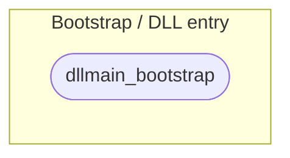

# Bootstrap / DLL entry

**1 feature(s) in this category.**

## Features

- [[features/dllmain_bootstrap|dllmain_bootstrap]] — `seeded` / `medium` — Dllmain Bootstrap

## Dependency graph

```mermaid
flowchart LR
  subgraph bootstrap["Bootstrap / DLL entry"]
    dllmain_bootstrap([dllmain_bootstrap])
  end
```
