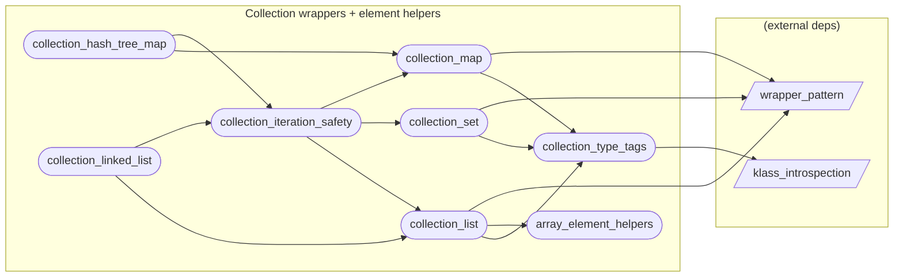

# Collection wrappers + element helpers

**8 feature(s) in this category.**

## Features

- [[features/array_element_helpers|array_element_helpers]] — `seeded` / `medium` — Array Element Helpers
- [[features/collection_hash_tree_map|collection_hash_tree_map]] — `seeded` / `medium` — Collection Hash Tree Map
- [[features/collection_iteration_safety|collection_iteration_safety]] — `seeded` / `medium` — Collection Iteration Safety
- [[features/collection_linked_list|collection_linked_list]] — `seeded` / `medium` — Collection Linked List
- [[features/collection_list|collection_list]] — `seeded` / `medium` — Collection List
- [[features/collection_map|collection_map]] — `seeded` / `medium` — Collection Map
- [[features/collection_set|collection_set]] — `seeded` / `medium` — Collection Set
- [[features/collection_type_tags|collection_type_tags]] — `seeded` / `medium` — Collection Type Tags

## Dependency graph

