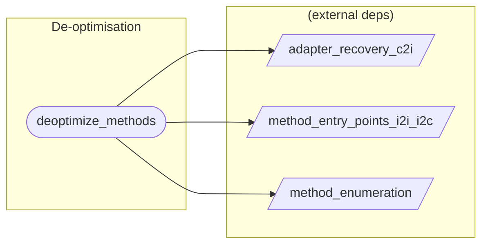

# De-optimisation

**1 feature(s) in this category.**

## Features

- [[features/deoptimize_methods|deoptimize_methods]] — `seeded` / `medium` — Deoptimize Methods

## Dependency graph

```mermaid
flowchart LR
  subgraph deopt["De-optimisation"]
    deoptimize_methods([deoptimize_methods])
  end
  subgraph external["(external deps)"]
    adapter_recovery_c2i[/adapter_recovery_c2i/]
    method_entry_points_i2i_i2c[/method_entry_points_i2i_i2c/]
    method_enumeration[/method_enumeration/]
  end
  deoptimize_methods --> method_enumeration
  deoptimize_methods --> adapter_recovery_c2i
  deoptimize_methods --> method_entry_points_i2i_i2c
```
