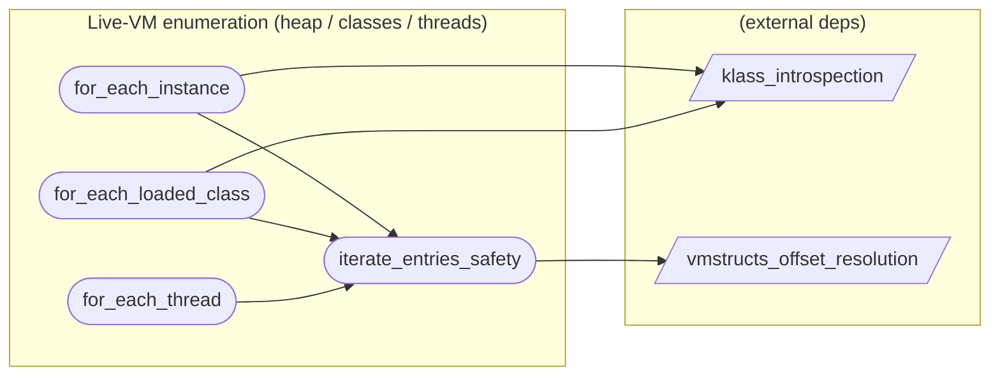

# Live-VM enumeration (heap / classes / threads)

**4 feature(s) in this category.**

## Features

- [[features/for_each_instance|for_each_instance]] — `in_progress` / `medium` — For Each Instance
- [[features/for_each_loaded_class|for_each_loaded_class]] — `in_progress` / `medium` — For Each Loaded Class
- [[features/for_each_thread|for_each_thread]] — `in_progress` / `medium` — For Each Thread
- [[features/iterate_entries_safety|iterate_entries_safety]] — `seeded` / `high` — Iterate Entries Safety

## Dependency graph

