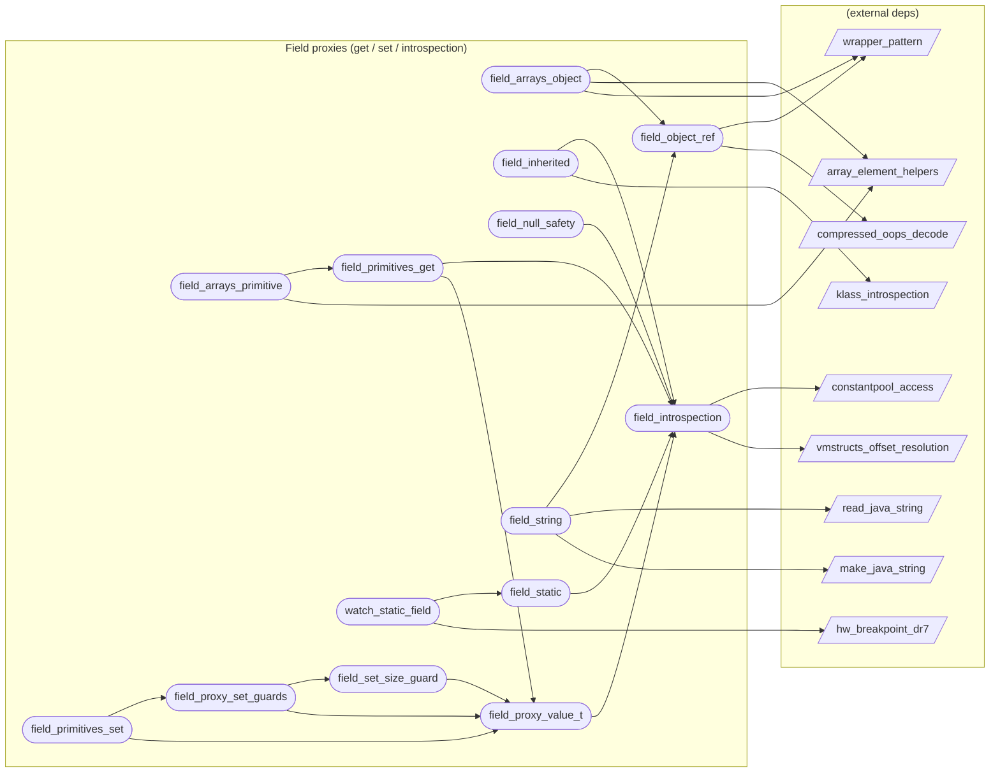

# Field proxies (get / set / introspection)

**14 feature(s) in this category.**

## Features

- [[features/field_arrays_object|field_arrays_object]] — `seeded` / `medium` — Field Arrays Object
- [[features/field_arrays_primitive|field_arrays_primitive]] — `seeded` / `medium` — Field Arrays Primitive
- [[features/field_inherited|field_inherited]] — `seeded` / `medium` — Field Inherited
- [[features/field_introspection|field_introspection]] — `seeded` / `medium` — Field Introspection
- [[features/field_null_safety|field_null_safety]] — `seeded` / `medium` — Field Null Safety
- [[features/field_object_ref|field_object_ref]] — `seeded` / `medium` — Field Object Ref
- [[features/field_primitives_get|field_primitives_get]] — `seeded` / `medium` — Field Primitives Get
- [[features/field_primitives_set|field_primitives_set]] — `seeded` / `medium` — Field Primitives Set
- [[features/field_proxy_set_guards|field_proxy_set_guards]] — `seeded` / `medium` — Field Proxy Set Guards
- [[features/field_proxy_value_t|field_proxy_value_t]] — `seeded` / `medium` — Field Proxy Value T
- [[features/field_set_size_guard|field_set_size_guard]] — `seeded` / `medium` — Field Set Size Guard
- [[features/field_static|field_static]] — `seeded` / `medium` — Field Static
- [[features/field_string|field_string]] — `seeded` / `medium` — Field String
- [[features/watch_static_field|watch_static_field]] — `seeded` / `medium` — Watch Static Field

## Dependency graph

