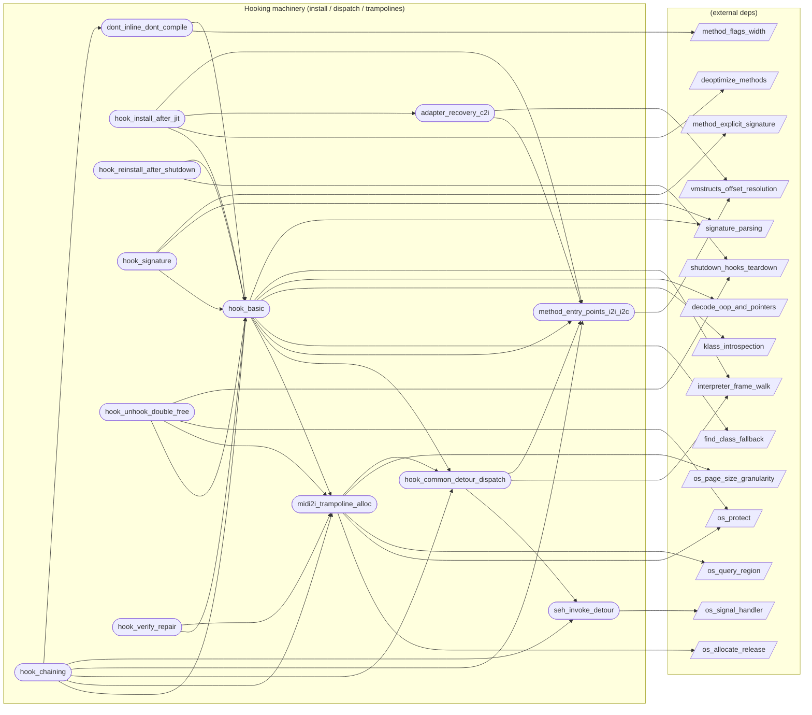

# Hooking machinery (install / dispatch / trampolines)

**13 feature(s) in this category.**

## Features

- [[features/adapter_recovery_c2i|adapter_recovery_c2i]] — `seeded` / `medium` — Adapter Recovery C2I
- [[features/dont_inline_dont_compile|dont_inline_dont_compile]] — `seeded` / `medium` — Dont Inline Dont Compile
- [[features/hook_basic|hook_basic]] — `in_progress` / `critical` — Hook Install (basic)
- [[features/hook_chaining|hook_chaining]] — `in_progress` / `high` — Hook Chaining
- [[features/hook_common_detour_dispatch|hook_common_detour_dispatch]] — `seeded` / `medium` — Hook Common Detour Dispatch
- [[features/hook_install_after_jit|hook_install_after_jit]] — `in_progress` / `critical` — Hook Install After Jit
- [[features/hook_reinstall_after_shutdown|hook_reinstall_after_shutdown]] — `seeded` / `medium` — Hook Reinstall After Shutdown
- [[features/hook_signature|hook_signature]] — `seeded` / `medium` — Hook Signature
- [[features/hook_unhook_double_free|hook_unhook_double_free]] — `in_progress` / `high` — Hook Unhook / Double-Free Guards
- [[features/hook_verify_repair|hook_verify_repair]] — `seeded` / `medium` — Hook Verify Repair
- [[features/method_entry_points_i2i_i2c|method_entry_points_i2i_i2c]] — `in_progress` / `critical` — Method Entry Points I2I / I2C
- [[features/midi2i_trampoline_alloc|midi2i_trampoline_alloc]] — `in_progress` / `critical` — Midi2I Trampoline Alloc
- [[features/seh_invoke_detour|seh_invoke_detour]] — `seeded` / `medium` — Seh Invoke Detour

## Dependency graph

