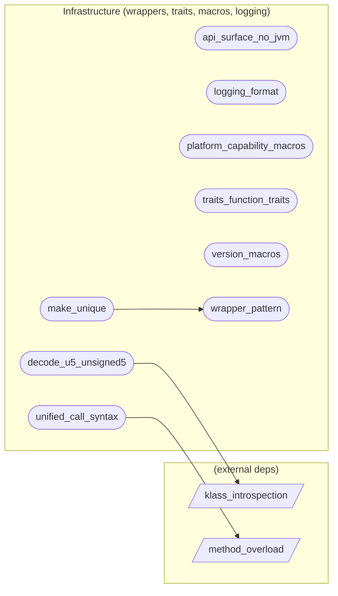

# Infrastructure (wrappers, traits, macros, logging)

**9 feature(s) in this category.**

## Features

- [[features/api_surface_no_jvm|api_surface_no_jvm]] — `in_progress` / `medium` — API Surface (no-JVM contract)
- [[features/decode_u5_unsigned5|decode_u5_unsigned5]] — `in_progress` / `high` — Decode U5 Unsigned5
- [[features/logging_format|logging_format]] — `seeded` / `medium` — Logging Format
- [[features/make_unique|make_unique]] — `seeded` / `medium` — Make Unique
- [[features/platform_capability_macros|platform_capability_macros]] — `seeded` / `medium` — Platform Capability Macros
- [[features/traits_function_traits|traits_function_traits]] — `seeded` / `medium` — Traits Function Traits
- [[features/unified_call_syntax|unified_call_syntax]] — `seeded` / `medium` — Unified Call Syntax
- [[features/version_macros|version_macros]] — `seeded` / `medium` — Version Macros
- [[features/wrapper_pattern|wrapper_pattern]] — `seeded` / `medium` — Wrapper Pattern

## Dependency graph

