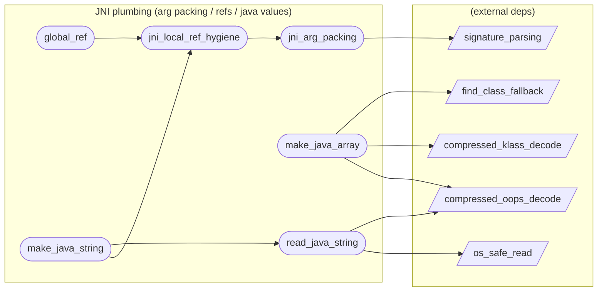

# JNI plumbing (arg packing / refs / java values)

**6 feature(s) in this category.**

## Features

- [[features/global_ref|global_ref]] — `in_progress` / `medium` — Global Ref
- [[features/jni_arg_packing|jni_arg_packing]] — `seeded` / `medium` — Jni Arg Packing
- [[features/jni_local_ref_hygiene|jni_local_ref_hygiene]] — `seeded` / `high` — Jni Local Ref Hygiene
- [[features/make_java_array|make_java_array]] — `seeded` / `high` — Make Java Array
- [[features/make_java_string|make_java_string]] — `in_progress` / `medium` — Make Java String
- [[features/read_java_string|read_java_string]] — `seeded` / `medium` — Read Java String

## Dependency graph

