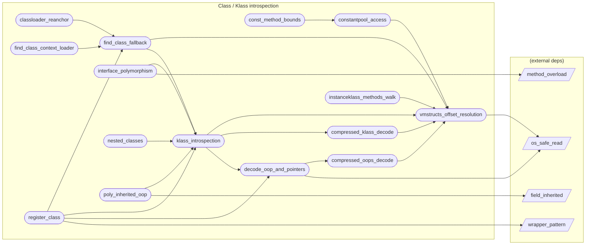

# Class / Klass introspection

**15 feature(s) in this category.**

## Features

- [[features/classloader_reanchor|classloader_reanchor]] — `seeded` / `medium` — Classloader Reanchor
- [[features/compressed_klass_decode|compressed_klass_decode]] — `seeded` / `medium` — Compressed Klass Decode
- [[features/compressed_oops_decode|compressed_oops_decode]] — `seeded` / `medium` — Compressed Oops Decode
- [[features/const_method_bounds|const_method_bounds]] — `seeded` / `medium` — Const Method Bounds
- [[features/constantpool_access|constantpool_access]] — `seeded` / `medium` — Constantpool Access
- [[features/decode_oop_and_pointers|decode_oop_and_pointers]] — `seeded` / `medium` — Decode Oop And Pointers
- [[features/find_class_context_loader|find_class_context_loader]] — `seeded` / `medium` — Find Class Context Loader
- [[features/find_class_fallback|find_class_fallback]] — `seeded` / `medium` — Find Class Fallback
- [[features/instanceklass_methods_walk|instanceklass_methods_walk]] — `seeded` / `medium` — Instanceklass Methods Walk
- [[features/interface_polymorphism|interface_polymorphism]] — `seeded` / `medium` — Interface Polymorphism
- [[features/klass_introspection|klass_introspection]] — `in_progress` / `high` — Klass Introspection
- [[features/nested_classes|nested_classes]] — `seeded` / `medium` — Nested Classes
- [[features/poly_inherited_oop|poly_inherited_oop]] — `seeded` / `medium` — Poly Inherited Oop
- [[features/register_class|register_class]] — `in_progress` / `high` — Register Class
- [[features/vmstructs_offset_resolution|vmstructs_offset_resolution]] — `in_progress` / `critical` — VMStructs Offset Resolution

## Dependency graph

