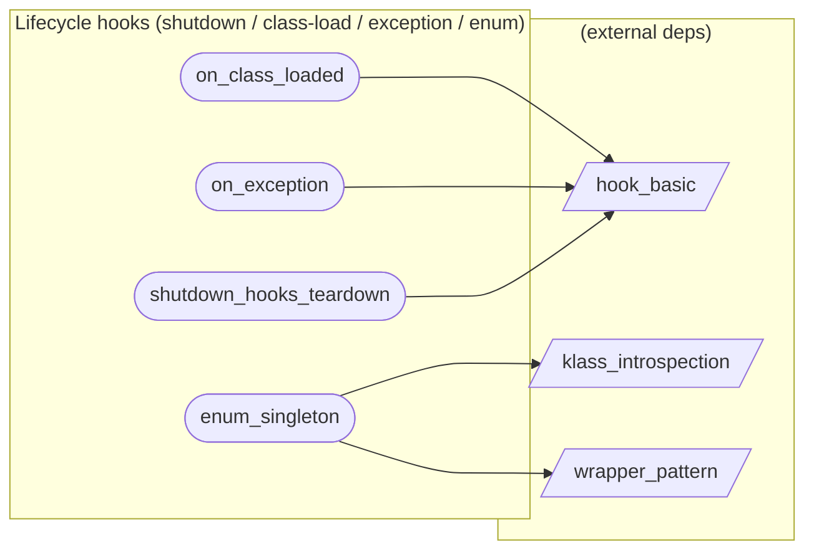

# Lifecycle hooks (shutdown / class-load / exception / enum)

**4 feature(s) in this category.**

## Features

- [[features/enum_singleton|enum_singleton]] — `seeded` / `medium` — Enum Singleton
- [[features/on_class_loaded|on_class_loaded]] — `seeded` / `medium` — On Class Loaded
- [[features/on_exception|on_exception]] — `seeded` / `medium` — On Exception
- [[features/shutdown_hooks_teardown|shutdown_hooks_teardown]] — `seeded` / `medium` — Shutdown Hooks Teardown

## Dependency graph

