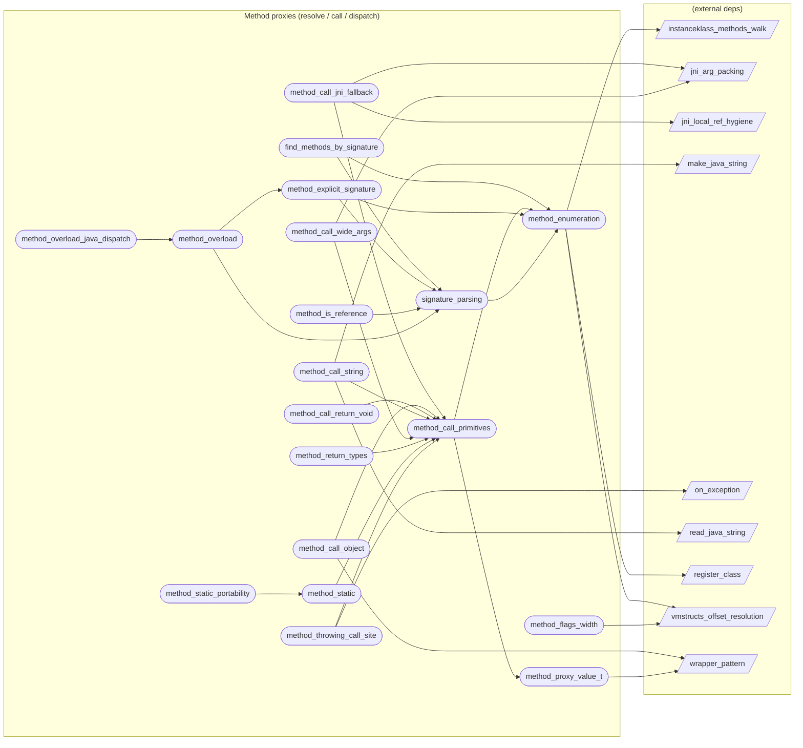

# Method proxies (resolve / call / dispatch)

**19 feature(s) in this category.**

## Features

- [[features/find_methods_by_signature|find_methods_by_signature]] — `seeded` / `medium` — Find Methods By Signature
- [[features/method_call_jni_fallback|method_call_jni_fallback]] — `seeded` / `medium` — Method Call Jni Fallback
- [[features/method_call_object|method_call_object]] — `seeded` / `medium` — Method Call Object
- [[features/method_call_primitives|method_call_primitives]] — `seeded` / `medium` — Method Call Primitives
- [[features/method_call_return_void|method_call_return_void]] — `seeded` / `medium` — Method Call Return Void
- [[features/method_call_string|method_call_string]] — `seeded` / `medium` — Method Call String
- [[features/method_call_wide_args|method_call_wide_args]] — `seeded` / `medium` — Method Call Wide Args
- [[features/method_enumeration|method_enumeration]] — `in_progress` / `medium` — Method Enumeration
- [[features/method_explicit_signature|method_explicit_signature]] — `seeded` / `medium` — Method Explicit Signature
- [[features/method_flags_width|method_flags_width]] — `seeded` / `medium` — Method Flags Width
- [[features/method_is_reference|method_is_reference]] — `seeded` / `medium` — Method Is Reference
- [[features/method_overload|method_overload]] — `seeded` / `medium` — Method Overload
- [[features/method_overload_java_dispatch|method_overload_java_dispatch]] — `seeded` / `medium` — Method Overload Java Dispatch
- [[features/method_proxy_value_t|method_proxy_value_t]] — `seeded` / `medium` — Method Proxy Value T
- [[features/method_return_types|method_return_types]] — `seeded` / `medium` — Method Return Types
- [[features/method_static|method_static]] — `seeded` / `medium` — Method Static
- [[features/method_static_portability|method_static_portability]] — `seeded` / `medium` — Method Static Portability
- [[features/method_throwing_call_site|method_throwing_call_site]] — `seeded` / `medium` — Method Throwing Call Site
- [[features/signature_parsing|signature_parsing]] — `in_progress` / `medium` — Signature Parsing

## Dependency graph

