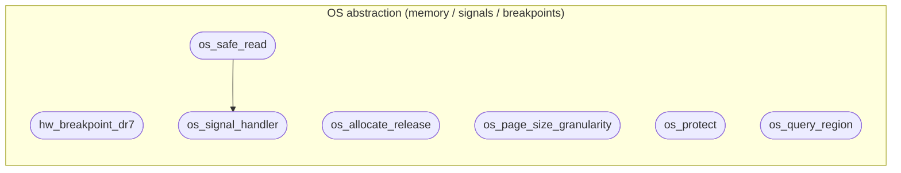

# OS abstraction (memory / signals / breakpoints)

**7 feature(s) in this category.**

## Features

- [[features/hw_breakpoint_dr7|hw_breakpoint_dr7]] — `seeded` / `medium` — Hw Breakpoint Dr7
- [[features/os_allocate_release|os_allocate_release]] — `seeded` / `medium` — Os Allocate Release
- [[features/os_page_size_granularity|os_page_size_granularity]] — `seeded` / `medium` — Os Page Size Granularity
- [[features/os_protect|os_protect]] — `seeded` / `medium` — Os Protect
- [[features/os_query_region|os_query_region]] — `seeded` / `medium` — Os Query Region
- [[features/os_safe_read|os_safe_read]] — `seeded` / `medium` — Os Safe Read
- [[features/os_signal_handler|os_signal_handler]] — `seeded` / `medium` — Os Signal Handler

## Dependency graph

