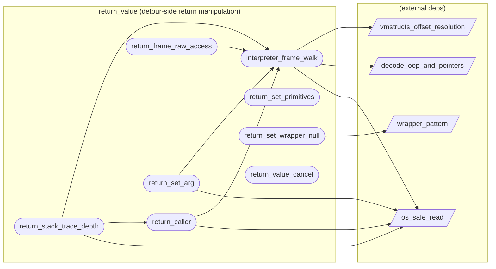

# return_value (detour-side return manipulation)

**8 feature(s) in this category.**

## Features

- [[features/interpreter_frame_walk|interpreter_frame_walk]] — `seeded` / `high` — Interpreter Frame Walk
- [[features/return_caller|return_caller]] — `seeded` / `high` — Return Caller
- [[features/return_frame_raw_access|return_frame_raw_access]] — `seeded` / `high` — Return Frame Raw Access
- [[features/return_set_arg|return_set_arg]] — `seeded` / `high` — Return Set Arg
- [[features/return_set_primitives|return_set_primitives]] — `seeded` / `medium` — Return Set Primitives
- [[features/return_set_wrapper_null|return_set_wrapper_null]] — `seeded` / `medium` — Return Set Wrapper Null
- [[features/return_stack_trace_depth|return_stack_trace_depth]] — `seeded` / `high` — Return Stack Trace Depth
- [[features/return_value_cancel|return_value_cancel]] — `seeded` / `medium` — Return Value Cancel

## Dependency graph

